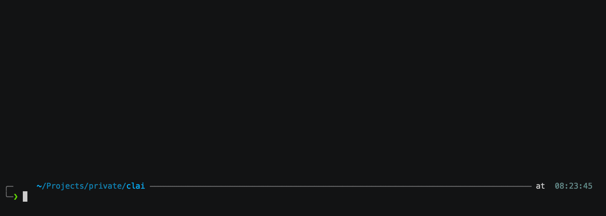

# Examples

First of all, please see help for additional information on what can be done:

```bash
clai help `# For more info about the available commands (and shorthands)`
```

### Queries

```bash
clai query My favorite color is blue, tell me some facts about it
```

```bash
clai -re `# Use the -re flag to use the previous query as context for some next query` \
    q Write a poem about my favorite colour
```

Personally I have `alias ask=clai q` and then `alias rask=clai -re q`.
This way I can `ask` -> `rask` -> `rask` for a temporary conversation.

Every 'temporary conversation' is also saved as a chat, so it's possible to continue it later, see below on how to list chats.

Piping into queries is also very useful:

<div align="center">
  
</div>

With this, any data may be piped into Clai -> some LLM.

Some tips of what to use it with:

- `git diff | clai query Please analyze this diff and give me a review` (tip: you may also use the [git tool](../internal/tools/programming_tool_git.go))
- `cat /tmp/some-well-prompted-specialized-task | clai query Do this task:` (tip: you may also use the [cat](../internal/tools/bash_tool_cat.go))
- `dig lorentz.app | clai query Please tell me what this arcane output means:`

### Tooling

Many vendors support function calling/tooling.
This basically means that the AI model will ask _your local machine_ to run some command, then it will analyze the output of said command.

See all the currently available tools [here](./internal/tools/).

```bash
clai -t q  `# Specify you wish to enable tools with -t/-tools` \
   Analyze the project found at ~/Projects/clai and give me a brief summary of what it does
```

There's also support for [MCP servers](https://modelcontextprotocol.io/examples).

Easiest way to integrate them is to paste them using the setup command: `clai setup -> 3 -> 'p'`, following this format:

```
{
  "mcpServers": {
    "everything": {
      "command": "npx",
      "args": [
        "-y",
        "@modelcontextprotocol/server-everything"
      ]
    }
  }
}
```

### Conversations

```bash
clai -chat-model claude-sonnet-4-20250514 `  # Using some other model` \
    chat new Lets have a conversation about Hegel
```

The `-cm`/`-chat-model` flag works for any text-like command.
Meaning: you can start a conversation with one chat model, then continue it with another.

Continue a previous conversation with:

```bash
clai chat list
```

<div align="center">
  
</div>

or by using the chat's filename. The filename is generated by the 5 first tokens in the chat.

```bash
clai c continue Lets_have_a_conversation_about
```

```bash
clai c continue 1 kant is better `# Continue some previous chat with message `
```

Within [os.GetConfigDir()](https://pkg.go.dev/os#UserConfigDir)`/.clai/conversations` you'll find all the conversations.
You can also modify the chats here as a way to prompt, or create entirely new ones as you see fit.

### Profiles

1. `clai setup -> 2 -> n`
1. Write some profile, example [gopher](./examples/profiles/gopher.json)
1. `cat main.go | clai -profile gopher q Fix the tests in this file: `

See some examples of profiles [here](./examples/profiles/) and them try them out with `go run . -profile-path ./examples/profiles/cody.json query What is your purpose\?`

Profiles allow you to preconfigure certain fields passed to the LLMs, most notably the prompt and which tools to use.
This, in turn, enables you to quickly swap between different 'LLM-modes'.

For instance, you may have one profile which is prompted for golang programming tasks "gopher", it has tools `write_file`, `rip grep` and `go` enabled, and then another profile which is for terraform named "terry".
With these, you don't have to 'pre-prompt' with `clai q _in terraform_ ...` or `clai q _in golang_ ...` but instead can use `clai -p terry q ...`/`clai -p gopher q ...` and also restrict which tools are allowed, as opposed to enabling _all_ tools (with `-t`).

These profiles are saved as json at [os.GetConfigDir()](https://pkg.go.dev/os#UserConfigDir)`/.clai/profiles`.
This means that you can sync them across all of your machines and tweak your prompts wherever you code.

Here I've personally utilized aliases once more.

`ask` -> Generic profile-less prompt
`gask` -> `clai -p gopher q`, `grask` -> `clai -re -p gopher q` and then `task` -> `clai -p terry q`, etc.

These aliases are later synced with the rest of my dotfiles and clai profiles, so they're shared on all my development machines.

### Photos

```bash
printf "flowers" | clai -i `    # stdin replacement works for photos also` \
    --photo-prefix=flowercat `  # Sets the prefix for local photo` \
    --photo-dir=/tmp `          # Sets the output dir` \
    photo A cat made out of {}
```

Since -N alternatives are disabled for many newer OpenAI models, you can use [repeater](https://github.com/baalimago/repeater) to generate several responses from the same prompt:

```bash
NO_COLOR=true repeater -n 10 -w 3 -increment -file out.txt -output BOTH \
    clai -pp flower_INC p A cat made of flowers
```

## Configuration

`clai` will create configuration files at [os.GetConfigDir()](https://pkg.go.dev/os#UserConfigDir)`/.clai/`.
First time you run `clai`, two default command-related configurations will be created: `textConfig.json` and `photoConfig.json`.
These command config files may also be modified with `clai setup -> 0`.

Then, one configuration file will be created for each specific model (for instance `chat-gpt-4.1` -> `openai_chat-gpt_chat-gpt-4.1`).
The model configuration files may be modified with `clai setup -> 1`.
The configuration precedence is as follows (from lowest to highest):

1. Default hard-coded configurations [such as this](./internal/text/conf.go), these get written to file the first time you run `clai`
1. `textConfig.json` or `photoConfig.json`
1. Models specific configs (`openai_chat-gpt_chat-gpt-4`, and similar)
1. Profiles
1. Flags

### Models

There's three ways to configure the models:

1. Set flag `-chat-model` or `-photo-model`
1. Set the `model` field in the `textConfig.json` or `photoConfig.json` file. This will make it default, if not overwritten by flags.
1. [Profiles](#profiles)

Then, for each model, a new configuration file will be created.
Since each vendor's model supports quite different configurations, the model configurations aren't exposed as flags.
Instead, modify the model by adjusting its configuration file, found in [os.GetConfigDir()](https://pkg.go.dev/os#UserConfigDir)`/.clai/<vendor>_<model-type>_<model-name>.json`.
This config JSON will in effect be unmarshaled into a request sent to the model's vendor.

The model-specific configs may be modified with `clai setup -> 1`.
