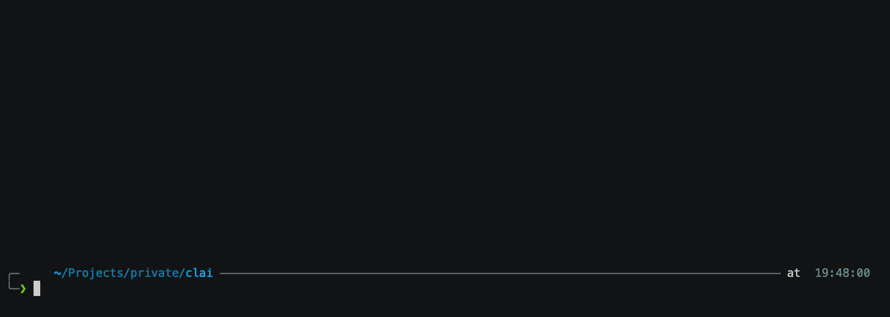
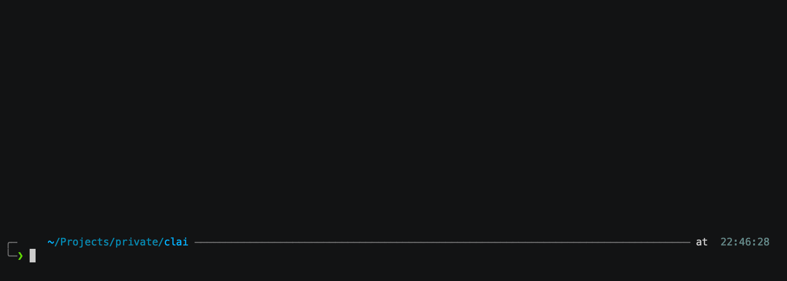

# clai: command line artificial intelligence

[](https://goreportcard.com/report/github.com/baalimago/clai)


`clai` integrates AI models of multiple vendors via with the terminal.
You can generate images, text, summarize content and chat while using native terminal functionality, such as pipes and termination signals.

The multi-vendor aspect enables easy comparisons between different models, also removes the need for multiple subscriptions: most APIs are usage-based (some with expiration time).

## Features

Piping into LLM:


Easily configurable profiles (note the built in tools!):


Conversation history and simple TUI to browse and continue old chats:


These three features combined makes it quite portable.
Personally I have customized my neovim setup to pipe/glob buffers into it, alongside pre-prompted profiles, to create what I call GhettoPilot.
But that's besides the point.
Let's continue:

## Supported vendors

- **OpenAI API Key:** Set the `OPENAI_API_KEY` env var to your [OpenAI API key](https://platform.openai.com/docs/quickstart/step-2-set-up-your-api-key). [Text models](https://platform.openai.com/docs/models/gpt-4-and-gpt-4-turbo), [photo models](https://platform.openai.com/docs/models/dall-e).
- **Anthropic API Key:** Set the `ANTHROPIC_API_KEY` env var to your [Anthropic API key](https://console.anthropic.com/login?returnTo=%2F). [Text models](https://docs.anthropic.com/claude/docs/models-overview#model-recommendations).
- **Mistral API Key:** Set the `MISTRAL_API_KEY` env var to your [Mistral API key](https://console.mistral.ai/). [Text models](https://docs.mistral.ai/getting-started/models/)
- **Deepseek:** Set the `DEEPSEEK_API_KEY` env var to your [Deepseek API key](https://api-docs.deepseek.com/). [Text models](https://api-docs.deepseek.com/quick_start/pricing)
- **Novita AI:** Set the `NOVITA_API_KEY` env var to your [Novita API key](https://novita.ai/settings?utm_source=github_clai&utm_medium=github_readme&utm_campaign=link#key-management). Target the model using novita prefix, like this: `novita:<target>`, where `<target>` is one of the [text models](https://novita.ai/model-api/product/llm-api?utm_source=github_clai&utm_medium=github_readme&utm_campaign=link).
- **Ollama:** Start your ollama server (defaults to localhost:11434). Target using model format `ollama:<target>`, where `<target>` is optional (defaults to llama3). Reconfigure url with `clai setup -> 1 -> <ollama-model-conf>`

Note that you can only use the models that you have bought an API key for.

## Get started

Install [Glow](https://github.com/charmbracelet/glow) for formatted markdown output when querying text responses.

```bash
go install github.com/baalimago/clai@latest
```

You may also use the setup script:

```bash
curl -fsSL https://raw.githubusercontent.com/baalimago/clai/main/setup.sh | sh
```

Either look at `clai help` or the [examples](./EXAMPLES.md) for how to use `clai`.

## Honorable mentions

This project was originally inspired by: [https://github.com/Licheam/zsh-ask](https://github.com/Licheam/zsh-ask), many thanks to Licheam for the inspiration.
